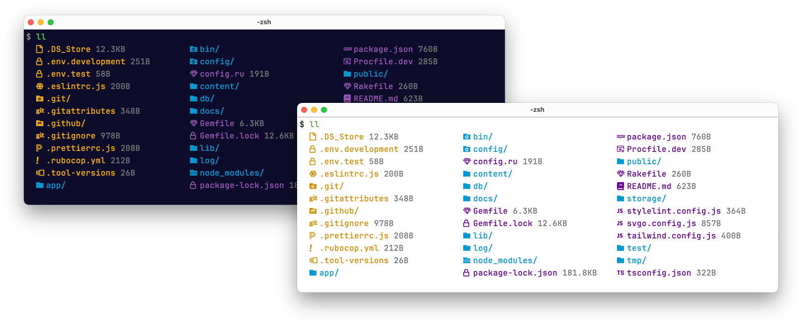

# ll

A prettier terminal's ls command, with color and
[nerdfonts.com](https://www.nerdfonts.com/) icons.

[](screenshot.png)

## Install

### Homebrew

```console
$ brew install fnando/tap/ll
```

### Others

Download the binary for your architecture from
https://github.com/fnando/ll/releases/latest
